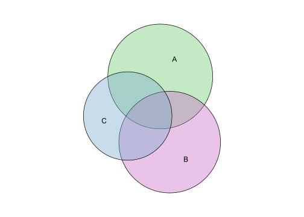

<!-- README.md is generated from README.Rmd. Please edit that file -->
eulerr
======

[](https://travis-ci.org/jolars/eulerr) [](https://ci.appveyor.com/project/jolars/eulerr) [](https://codecov.io/gh/jolars/eulerr) [](https://cran.r-project.org/package=eulerr)

**eulerr** generates area-proportional euler diagrams that display set relationships (intersections, unions, and disjoints) with circles. [Euler diagrams](https://en.wikipedia.org/wiki/Euler_diagram) are Venn diagrams without the requirement that all set interactions be present (whether they are empty or not). That is, depending on input, eulerr will sometimes produce Venn diagrams but sometimes not.

With three or more sets intersecting, exact euler diagrams are often impossible. For such cases eulerr attempts to provide the best approximation possible by numerically tuning the circles' positions and radiuses so that the sum of squared errors is minimized.

When solutions are approximate, residuals and error statistics are provided to assess whether the resulting diagram can be trusted.

Installation
------------

The CRAN version can be installed by running

``` r
install.packages("eulerr")
```

The development version can be installed by running

``` r
devtools::install_github("jolars/eulerr")
```

Usage
-----

``` r
library(eulerr)
sets <- c("A" = 10, "B" = 9, "C" = 4,
          "A&B" = 2, "A&C" = 3, "B&C" = 3,
          "A&B&C" = 2)
fit <- euler(sets)
```

We can inspect the solution

``` r
fit
#>       original fitted residuals region_error
#> A           10 10.044    -0.044        0.005
#> B            9  9.050    -0.050        0.005
#> C            4  4.128    -0.128        0.005
#> A&B          2  1.601     0.399        0.011
#> A&C          3  2.719     0.281        0.007
#> B&C          3  2.716     0.284        0.008
#> A&B&C        2  2.324    -0.324        0.011
#> 
#> diagError:  0.011 
#> stress:     0.002
```

and plot it

``` r
plot(fit)
```



Please see the [introductory vignette](https://CRAN.R-project.org/package=eulerr/vignettes/introduction.html) for usage details.

License
-------

eulerr is open source software, licensed under [GPL-3](LICENSE).

Versioning
----------

Version numbers are based on the principles of [semantic versioning](http://semver.org).

Code of conduct
---------------

Please note that this project is released with a [Contributor Code of Conduct](CONDUCT.md). By participating in this project you agree to abide by its terms.

Thanks
------

eulerr would not be possible without Ben Fredrickson's work on [venn.js](http://www.benfrederickson.com) or Leland Wilkinson's [venneuler](https://cran.r-project.org/package=venneuler).
