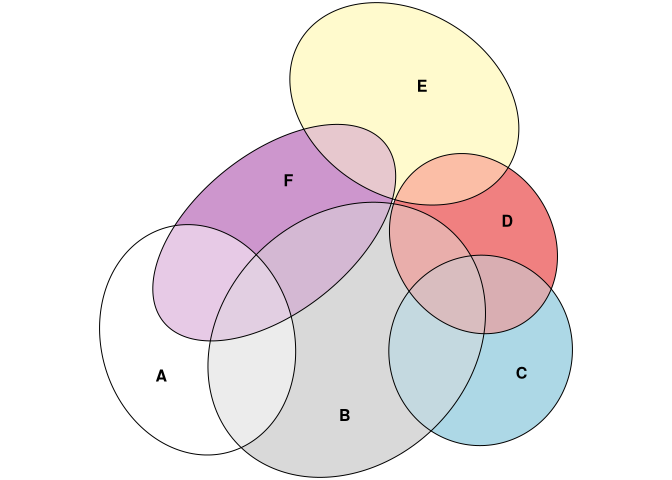

<!-- README.md is generated from README.Rmd. Please edit that file -->

# eulerr <a href="https://jolars.github.io/eulerr/"></a>

<!-- badges: start -->

[](https://github.com/jolars/eulerr/actions/workflows/R-CMD-check.yaml)
[](https://app.codecov.io/gh/jolars/eulerr)
[](https://cran.r-project.org/package=eulerr)
<!-- badges: end -->

**eulerr** generates area-proportional Euler diagrams that display set
relationships (intersections, unions, and disjoints) with circles or
ellipses. [Euler diagrams](https://en.wikipedia.org/wiki/Euler_diagram)
are Venn diagrams without the requirement that all set interactions be
present (whether they are empty or not), which means that, depending on
input, **eulerr** sometimes produces Venn diagrams and sometimes not.

With three or more sets intersecting, exact Euler diagrams are often
impossible. For such cases **eulerr** attempts to provide a good
approximation by numerically tuning the parameters of the ellipses or
circles to minimize the error in the resulting diagram. Residuals and
goodness of fit statistics are provided to assess whether the resulting
diagram can be trusted.

## Installation

### CRAN version

``` r
install.packages("eulerr")
```

### Development version

``` r
devtools::install_github("jolars/eulerr")
```

### Shiny app

eulerr is also available as a shiny app hosted at
[eulerr.co](http://eulerr.co).

## Usage

``` r
library(eulerr)
# From Wilkinson 2012
fit <- euler(
  c(
    "A" = 4,
    "B" = 6,
    "C" = 3,
    "D" = 2,
    "E" = 7,
    "F" = 3,
    "A&B" = 2,
    "A&F" = 2,
    "B&C" = 2,
    "B&D" = 1,
    "B&F" = 2,
    "C&D" = 1,
    "D&E" = 1,
    "E&F" = 1,
    "A&B&F" = 1,
    "B&C&D" = 1
  ),
  shape = "ellipse"
)
#>          [,1]     [,2]     [,3]     [,4]     [,5]     [,6]
#> [1,] 0.000000 2.431149 3.185274 3.074545 3.385137 1.872972
#> [2,] 2.431149 0.000000 2.180277 2.417538 3.877666 2.431149
#> [3,] 3.185274 2.180277 0.000000 1.658273 3.185274 3.185274
#> [4,] 3.074545 2.417538 1.658273 0.000000 2.337734 3.074545
#> [5,] 3.385137 3.877666 3.185274 2.337734 0.000000 2.677298
#> [6,] 1.872972 2.431149 3.185274 3.074545 2.677298 0.000000
#> $minimum
#> [1] 0.01234691
#> 
#> $estimate
#>  [1] 5.1740141 2.7706299 0.6023102 1.1415200 2.2857921 4.2059822 4.1508525
#>  [8] 4.5172251 4.2891969 2.7210386 0.6741519 2.5474379
#> 
#> $gradient
#>  [1] -1.476519e-06  5.573794e-06  8.483983e-07 -4.816617e-06  2.730104e-06
#>  [6] -2.859160e-06  2.824661e-06  9.229413e-08 -1.655492e-06 -4.657942e-06
#> [11]  9.740097e-06 -6.343618e-06
#> 
#> $code
#> [1] 2
#> 
#> $iterations
#> [1] 36
```

We can inspect the goodness-of-fit metrics *diagError* and *stress* for
the solution,

``` r
fit$stress
#> [1] 1.031469e-11
fit$diagError
#> [1] 9.220587e-07
```

and plot it

``` r
plot(fit)
```

<!-- -->

Please see [the introductory
vignette](https://CRAN.R-project.org/package=eulerr/vignettes/introduction.html)
for a brief introduction or [*eulerr under the
hood*](https://CRAN.R-project.org/package=eulerr/vignettes/under-the-hood.html)
for details.

## License

eulerr is open source software, licensed under
[GPL-3](https://github.com/jolars/eulerr/blob/master/LICENSE).

## Versioning

eulerr uses [semantic versioning](https://semver.org).

## Code of conduct

Please note that this project is released with a [Contributor Code of
Conduct](https://github.com/jolars/eulerr/blob/master/CONDUCT.md). By
participating in this project you agree to abide by its terms.

## Acknowledgements

eulerr would not be possible without Ben Frederickson’s work on
[venn.js](http://www.benfrederickson.com) or Leland Wilkinson’s
[venneuler](https://cran.r-project.org/package=venneuler).
